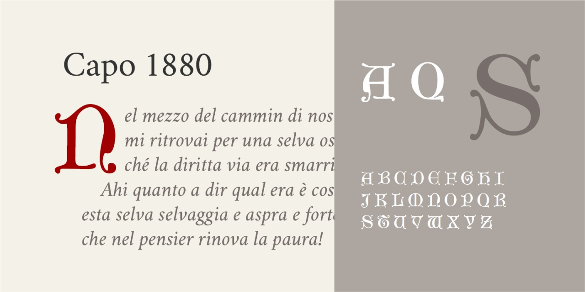

# Capo 1880
* Versione 1.101: fix esportazione
* Versione 1.0: versione iniziale

Per testare il font, vedere la [pagina interattiva](https://m-casanova.github.io/Capo1880/).

## Descrizione

_Capo 1880_ è un font basato su [caratteri realizzati attorno al 1880 dalla Cincinnati Type Foundry](https://babel.hathitrust.org/cgi/pt?id=nyp.33433006348324&seq=144).

Trattandosi di un capolettera, sono presenti solo le lettere maiuscole.
